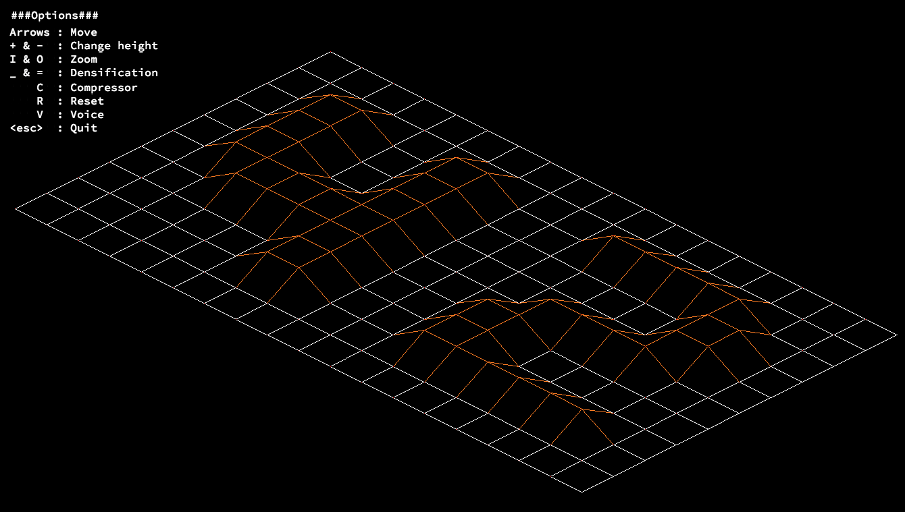

# FDF

## Pitch

FDF is a pedagogical project from 42 School which aims to introduce the students to computer graphics.  
With a minimalist graphic library that only allows to open a window, get the pixels buffer for each frame and handle keyboard inputs, the goal is to produce on screen a 3D representation of a map in the form of x-y-z coordinates in a text file.  
The result is a very basic graphic engine that runs on the CPU, written in C.

## Main features

- Isometric projection, controllable with a keyboard.
- Zooming
- Moving map
- Changing densification
- Color regarding heigh
- Voice bonus

## Things I have learned

- Better understanding of the C programming language and how to structure the code to keep a growing program maintanable, and open to new features.
- Bresenham's algorithm is applied to draw lines, resulting in a wireframe look.
- Use of MLX library, working with visuals using code.
- Use keyboard as controler, dealing with events in real time.
